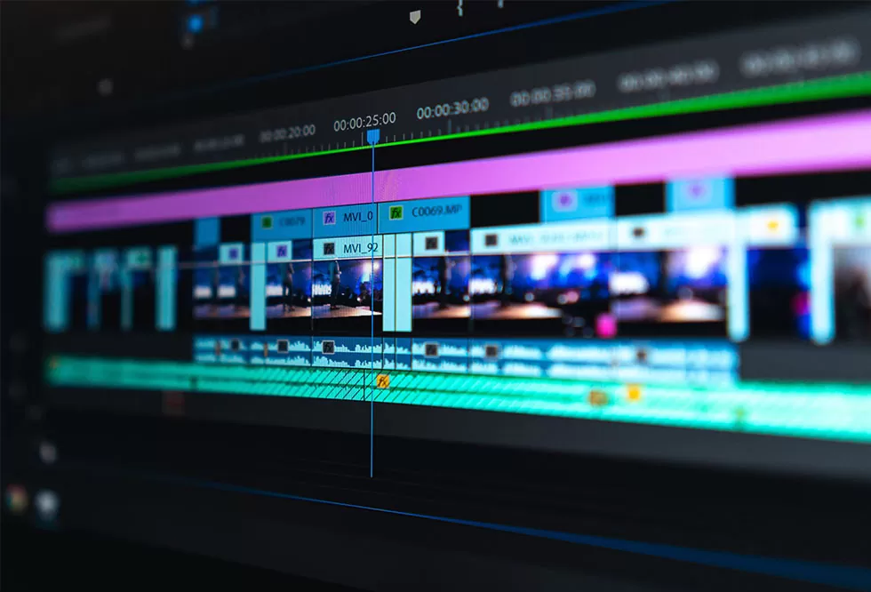

# Presentación Personal

**Nombre:** Santiago Arana Delgado
**Materia:** Programación Orientada a Objetos  

---

## Sobre mí

Soy estudiante de Produccion Audiovisual Interactiva y me interesa aprender sobre programación, tecnología, producción audiovisual y desarrollo de videojuegos.  
Me gusta entender cómo funcionan las cosas, crear proyectos digitales y aprender herramientas que me ayuden a construir ideas propias.

Me considero una persona curiosa, creativa y con muchas ganas de aprender.

---

## Mis intereses

- Desarrollo de videojuegos  
- Producción audiovisual y edición  
- Programación  
- Diseño digital  
- Viajar y conocer nuevas culturas  
- Cubos de Rubik

---

## Experiencia en programación

| Lenguaje | Nivel |
|------------|--------|
| Python | Básico – Intermedio |

---

## ¿Por qué me gusta la tecnología?

Me gusta la tecnología porque me permite crear, innovar y transformar ideas en proyectos reales.  
La programación y la producción audiovisual combinan lógica y creatividad, lo cual me parece muy chevere.

---

## Metas a futuro

- Mejorar mi nivel en programación  
- Aprender a desarrollar videojuegos  
- Crear proyectos propios  
- Viajar y conocer el mundo  

---

## Algo que me representa

